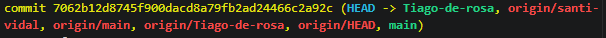

# Estadísticas del Repositorio

* **Integrante con mayor cantidad de commits:** [derosatiago-art] uso ([11] commits).
  * *Comando usado:* `git shortlog -s -n`

* **Cantidad total de merges realizados:** [5] merges.
  * *Comando usado:* `git rev-list --merges --count HEAD`

* **Cantidad de conflictos producidos:** [COMPLETAR NÚMERO] conflictos. *(Nota: Contabilizados manualmente a través de los Pull Requests en GitHub).*

* **Cantidad de ramas existentes en el repositorio:** [4] ramas.
  * *Comando usado:* `git branch -a`

* **Commit con la mayor cantidad de archivos modificados:**
  * *Hash del commit:* `[7062b12d8745f900dacd8a79fb2ad24466c2a92c]`
  * *Cantidad de archivos involucrados:* `[1 Archivo]`
  * *Comando usado para encontrarlo:* `git log --stat` y `git show 7062b12d8745f900dacd8a79fb2ad24466c2a92c`
  * *Captura del diff correspondiente:*  * **Captura de un conflicto previo a su resolución:**
  * *Hash del commit asociado:* 
  * *Captura del conflicto:* 

---

### 5. Archivo: `IA.md`
```markdown
# Documentación sobre el uso de IA

 Usamos un Modelo de Lenguaje Grande (LLM) como herramienta de asistencia para poder hacer este repositorio.

**Uso específico:**
* Ayudo en la resolución de errores de los comandos git.
* Ayudo en la estructura de los archivos.